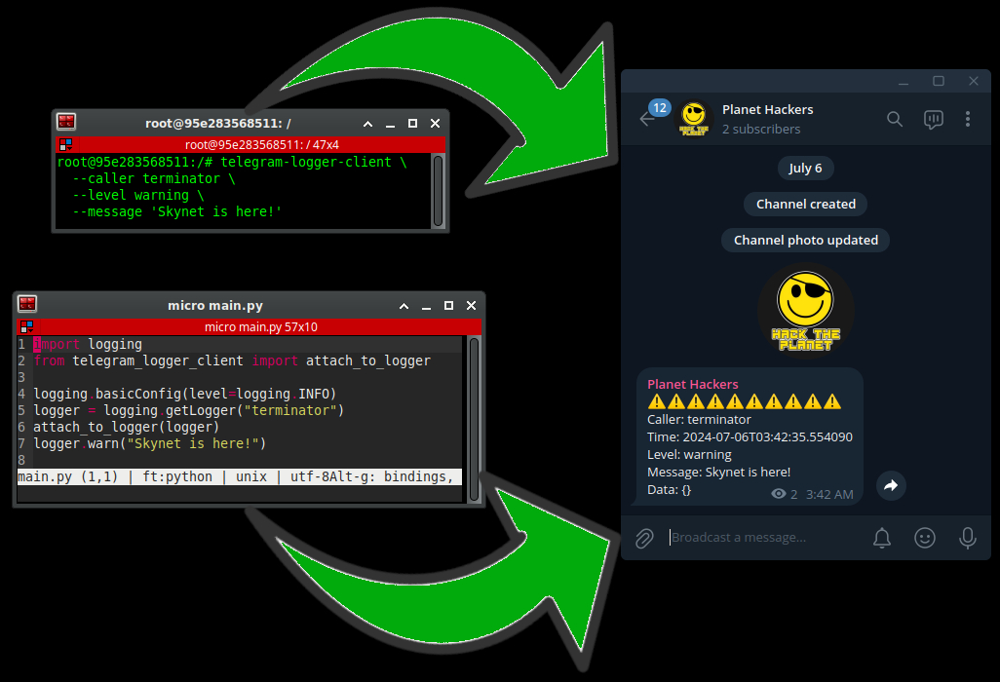

# 🚀 telegram-logger-client: Your Log's New Best Friend



Welcome to the telegram-logger-client - where your logs go to become stars!

## 🛠 Prerequisites

Before you dive in, make sure you've got your backstage pass ready:

1. You'll need to set up and run the telegram-logger service. It's like the bouncer at the club - without it, your logs aren't getting in.

2. Head over to [https://github.com/psyb0t/telegram-logger](https://github.com/psyb0t/telegram-logger) for the VIP instructions on setting up the telegram-logger service.

3. Once you've got that service up and running, come back here and let's make some noise!

## 🎭 Installation (No Secret Handshake Required)

Install this badass as a module and executable:

```shell
pip install telegram-logger-client
```

Go with `pipx` to just use it as an executable:

```shell
pipx install telegram-logger-client
```

## 🕹️ Usage (AKA How to Make Some Noise)

### 🐍 As a Python Module

Summon the TelegramLoggerClient in your Python code:

```python
from telegram_logger_client import TelegramLoggerClient

# Create your logger
logger = TelegramLoggerClient("https://your-logger-url.com", "your-secret-token")

# Send a log (it's like tweeting, but geekier)
logger.send_log(
    caller="CoffeeBot",
    level="warning",
    message="Coffee levels critically low!",
    error="Caffeine deficiency detected",
    request_id="coffee-run-42",
    trace_id="from-bed-to-coffee-machine",
    span_id="mug-to-mouth",
    data={"coffee_type": "Espresso", "sugar": False, "milk": "Oat"}
)
```

### 🔌 Attaching to Existing logging.loggers

Want to supercharge your existing logger with Telegram powers? We've got you covered! Use the `attach_to_logger` function to add Telegram logging to any logger instance:

```python
import logging
from telegram_logger_client import attach_to_logger

# Basic configuration for console output
logging.basicConfig(level=logging.DEBUG)

# Create your logger
logger = logging.getLogger("your_logger_name")

# Set up Telegram logging
attach_to_logger(logger)

# Use the logger as usual
logger.info("This will be sent to Telegram Logger and output to stdout")
```

The `attach_to_logger` function is like a magic wand that adds Telegram logging capabilities to your existing logger. It takes care of all the behind-the-scenes work, so you can focus on what really matters - logging your heart out!

Parameters for `attach_to_logger`:

- `logger`: Your existing logger instance (required)
- `base_url`: The URL where your Telegram Logger service lives (optional if set in environment)
- `x_id`: Your secret Telegram Logger handshake (optional if set in environment)
- `level`: Set a specific logging level for Telegram logging (optional)
- `show_originating_file`: Show the origin of the log (optional)

Don't forget to set your `TELEGRAM_LOGGER_BASE_URL` and `TELEGRAM_LOGGER_X_ID` environment variables, or pass them directly to `attach_to_logger`. Now go forth and log like a boss! 🚀📝

### 🖥️ Command Line Magic

First, set up your secret lair:

```shell
export TELEGRAM_LOGGER_BASE_URL=https://your-logger-url.com
export TELEGRAM_LOGGER_X_ID=your-secret-token
```

Now, shout into the void (or just send a log):

```shell
telegram-logger-client \
    --caller "WeatherBot" \
    --level "info" \
    --message "It's raining cats and dogs!" \
    --error "Umbrella malfunction" \
    --request-id "weather-101" \
    --trace-id "cloud-to-ground" \
    --span-id "drop-to-splash" \
    --data '{"temperature": "chilly", "wind": "breezy"}'
```

Want to see every little detail? Add the `--debug` flag:

```shell
telegram-logger-client \
    --debug \
    --caller "WeatherBot" \
    --level "info" \
    --message "It's raining cats and dogs!"
```

## 🎭 Logging Levels (Choose Your Adventure)

The client itself has two modes:

- Normal Mode (default): "Just the highlights" mode
- Debug Mode: "I can hear a pin drop" mode

Your logs, on the other hand, can be as dramatic as you want:

- "debug": "console.log" level
- "info": "Just FYI" level
- "warning": "Hmm, that's interesting" level
- "error": "Houston, we have a problem" level

## 🧙‍♂️ API Reference (The Boring but Important Bit)

### 🔮 TelegramLoggerClient

#### `__init__(base_url: str, x_id: str)`

Create your logger. Feed it URLs and tokens.

#### `send_log(...)`

Send your log on a grand adventure. Pack its bags with:

- `caller`: Who's making all this noise?
- `level`: How important is this, really?
- `message`: What's the scoop?
- `error`: What went boom?
- `request_id`: A unique ID for this particular escapade
- `trace_id`: For retracing your steps
- `span_id`: A slice of time in the grand timeline
- `data`: Any extra bits and bobs

Returns a `requests.Response` object (a postcard from your log's journey).

## 🗝️ Environment Variables (Your Logger's Secret Code)

- `TELEGRAM_LOGGER_BASE_URL`: Where your logs call home
- `TELEGRAM_LOGGER_X_ID`: Your logger's super-secret identity

## 🎲 Command Line Arguments (For When You're Feeling Bossy)

- `--debug`: Unleash the full power of logging (optional)
- `--base-url`: A new home for your logs
- `--x-id`: A new secret identity
- `--caller`: Who's calling?
- `--level`: On a scale of "meh" to "THE WORLD IS ENDING!"
- `--message`: Your log's 15 minutes of fame
- `--error`: What's gone sideways?
- `--request-id`: This log's personal serial number
- `--trace-id`: Breadcrumbs in the digital forest
- `--span-id`: A moment in time
- `--data`: Everything else but the kitchen sink

Remember: Command line arguments are the divas of the coding world - they always steal the show from environment variables.

## 📜 License (The Fine Print)

This project is unleashed under the WTFPL License – Do What The F\*\*k You Want To Public License. Your imagination is the only limit, push it to the boundaries!

Now go forth and log like there's no tomorrow! May your errors be few and your insights be plentiful. Happy logging! 📝🚀
